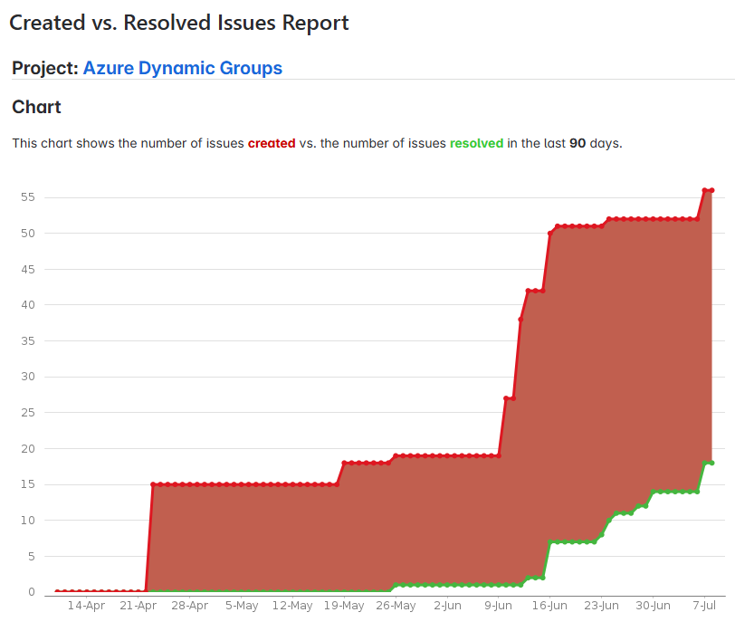

{: .no_toc }

# 1. Einleitung

## Vorwort

Das vorliegende Projekt zur automatisierten Verwaltung von Assets und Mailverteilern via Azure Dynamic Groups hat sich im Verlauf als umfassender erwiesen als ursprünglich angenommen. Die Entwicklung zahlreicher PowerShell‑Runbooks und die Integration verschiedener Systeme waren aufwändiger als erwartet und erforderten eine iterative Herangehensweise. Dennoch erfüllt der aktuelle Proof of Concept die definierten Projektziele ausreichend. Der weitere Projektfahrplan ist festgelegt und wird in den späteren Kapiteln genauer beschrieben.

In der folgenden Grafik sieht man, dass die anzahl Tasks über den Verlauf der Semesterarbeit massiv gestiegen ist. Der Chart stellt die erledigten und neu erstellten Tasks in einer Timeline dar.

----

## Ausgangslage

In der vorhandenen Azure‑Hybrid‑Umgebung werden Benutzerberechtigungen bislang überwiegend manuell vergeben. Dies führt zu inkonsistenten Zugriffsrechten, redundanten und unübersichtlichen Gruppenstrukturen und erhöhten Sicherheits- und Compliance‑Risiken.

Die HR‑Userdaten wurden teilweise bereits über ein script synchronisiert. Allerdings ist der Prozess bisher noch nicht vollständig automatisiert gewesen. Dieses Potenzial soll nun genutzt werden, um automatisierte Berechtigungszuweisungen mittels dynamischer Azure AD‑Gruppen zu realisieren.

**Problemstellung:**

- Manuelle Zuweisung von Berechtigungen führt zu inkonsistenten Zugriffsrechten, Sicherheits- und Compliance-Risiken.
- Dezentrale Mailverteilererstellung erzeugt Duplikate und unübersichtliche Gruppenstrukturen.
- Intune-App-Verteilung und SharePoint-Berechtigungen sind momentan nur unzureichend automatisiert.

----

## Anforderungen

### Funktionale Anforderungen

**Stammdaten & Inventar**
- Zentrale SharePoint/MS Lists-Liste aller Abteilungen & Sub-Abteilungen mit Codes, Beschreibungen, Ownern und Parent-Child-Beziehungen

**Dynamic Group Provisioning**
- Mail-Enabled Distribution Groups und Security Groups mit automatischer Mitgliedschaft über Abteilungscode-Query

**Naming Policy & Fallback**
- Azure AD Naming Policy gemäss definition des ICT Teams
- Fallback-Gruppe "General” (oder "undefined") für ungültige Codes, inklusive Review-Workflow

**Request & Approval**
- Microsoft Forms in SharePoint → Logic Apps → Multi-Stage-Approval (Antragsteller → Abteilungs-Owner → IT) → automatisierte Gruppenprovisionierung (z.B. für neue Abteilungen oder Mailverteiler)

**Kommunikation & Benachrichtigung**
- Automatische E-Mail/Teams-Alerts bei Group-Creation, Code-Changes, Decommissioning

**Lebenszyklus & Reviews**
- Gruppen-Expiration Policy (z.B. Archivierung nach 180 Tagen Inaktivität)
- Jährliche Access Reviews (optional)

**Test- und Validierungsframework**
- Wird mit der Pilotgruppe ICT getestet, sobald Konzept und Workflows definiert sind

----

### Prozessanforderungen

**Abteilungs-Lifecycle**
- Erstellen, Ändern, archivieren von Abteilungen mit Forms/SharePoint-List Intake, Genehmigungsworkflow, Inventory-Update und Provisioning

**Sub-Abteilungen / Rollen**
- Analog zu Top-Level, zusätzliche Assets nur für spezifische Sub-Gruppen (implizite Vererbung über Gruppenzugehörigkeit)
- Zuweisung von Sub-Abteilungen muss definiert werden (dynamic groups können nicht einander zugewiesen werden. Muss also über die Query gehandelt werden)

**Mailing-List-Management**
- Request (Forms), Provisioning (Exchange DG), Update (Owner driven bei individuellen Listen) und Decommission (Inaktivitätsreview)

**Asset-Management**
- Zentrales Katalogisieren, Zuweisen, Ändern und Entfernen von Assets manuell von System Engineers

**Onboarding / Offboarding**
- HR-Sync extensionAttribute → Azure AD Connect → Gruppenmitgliedschaft → Asset-Benachrichtigung bzw. bei Offboarding Lizenz-Entzug & Mailbox-Deaktivierung

**Change Management & Testing**
- JIRA-Change Requests für Änderungen an den Flows oder Definitionen
- Changes werden von System Engineers gehandhabt

----

## Ziele der Arbeit

### Automatisierte Berechtigungsverwaltung: 
Implementierung dynamischer Gruppen in Azure, die basierend auf dem Abteilungscode Berechtigungen (z. B. für SharePoint, Intune, Mailverteiler) automatisch zuweisen. 

### Auditing und Monitoring: 
Einrichtung eines zentralen Systems zur Dokumentation und Überwachung aller Änderungen an Berechtigungen, um inkonsistente oder unautorisierte Zuweisungen frühzeitig zu erkennen. 

### Systemintegration, Skalierbarkeit und Änderungsprozesse: 
Definition und Implementierung klarer Prozesse zur Aufnahme neuer Abteilungen, Rollen, Mailverteilerlisten und weiterer künftiger Erweiterungen, sodass das System flexibel und nachhaltig anpassbar bleibt. 

### Pilotphase 
Innerhalb der Semesterabeit ist das Ziel, eine Pilotphase mit der Abteilung ICT zu starten, in der das Konzept bereits für eine Abteilung getestet werden kann. Alle anderen Abteilungen werden nach Abschluss der Semesterarbeit nach und nach hinzugefügt.

----

## Abgrenzung (Scope)

**In Scope:**
- Konzeption & Implementierung dynamischer Azure AD-Gruppen inkl. zugehöriger Prozesse
- Pilotierung in ICT-Abteilung

**Out of Scope:**
- Auditing & Monitoring
- Vollständige Integration weiterer Systeme nach Projektabschluss
- Vervollständigung des Asset Inventars
- Komplette Onboarding/Offboarding-Szenarien (beyond attribute clearing)
- Automatische Benutzererstellung, Rollenmanagement (via Positionsname z.B.)
- SharePoint-Berechtigungen-Reengineering
- Eigenständige Licensing Groups
- Service Users handling in Azure AD