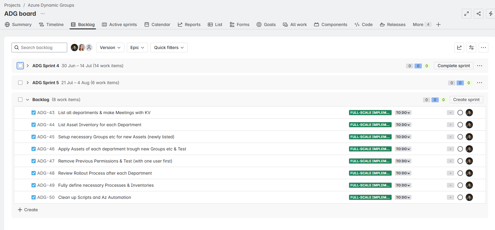

{: .no_toc }

# 2. Projektplanung

## Einsatz von Scrum im Projekt

Scrum ist ein agiles Projektmanagement- und Entwicklungsframework, das durch iterative und inkrementelle Vorgehensweisen gekennzeichnet ist. Es unterteilt die Arbeit in zeitlich begrenzte Sprints (in diesem Fall habe ich zwei Wochen pro Sprint definiert), in denen funktionsfähige Produktinkremente geliefert werden. Zentrale Elemente sind:

Zeitplanung: Feste Sprintlänge von zwei Wochen für Planbarkeit und Regelmässigkeit.

Rollen: In diesem Projekt habe ich sämtliche Scrum-Rollen (Product Owner, Scrum Master und Entwicklungsteam) selbst übernommen, wodurch alle Verantwortlichkeiten bei einer Person lagen.

Artefakte: Product Backlog, Sprint Backlog und Burndown Charts unterstützen Transparenz und Nachverfolgbarkeit.

Events: Sprint Planning am Ende jedes Sprints zur Planung des nächsten Sprints sowie wöchentliche Scrum-Meetings (mit gelegentlicher Teilnahme von Saskia Haas und David Feser für Status-Updates) sorgen für regelmässigen Austausch und ermöglichen eine flexible Reaktion auf neue Anforderungen.

Da das Projekt zu Beginn viele unklare Anforderungen aufwies und sowohl technische als auch organisatorische Aspekte umfasst, ermöglicht Scrum eine flexible Anpassung an neue Erkenntnisse. Tatsächlich ergaben sich im Verlauf zahlreiche Änderungen, die ich durch regelmässige Backlog-Pflege und Sprint-Neuplanungen effizient adressieren konnten.

Ich habe Sprints mit einer geplanten Dauer von zwei Wochen definiert. Gelegentlich wurde der Sprint nicht rechtzeitig abgeschlossen und ein neuer Sprint gestartet, da das Schliessen/Starten im Tool vergessen wurde. Die Verwaltung erfolgt über JIRA, dessen Sprint-Planungsansicht es ermöglicht, Backlog-Items per Drag & Drop in den aktiven Sprint zu ziehen und diesen mit einem Klick zu starten oder zu beenden. Für die automatisierte Generierung von Review-Dokumenten könnte Confluence eingesetzt werden, ist allerdings bei uns noch nicht im Einsatz.

