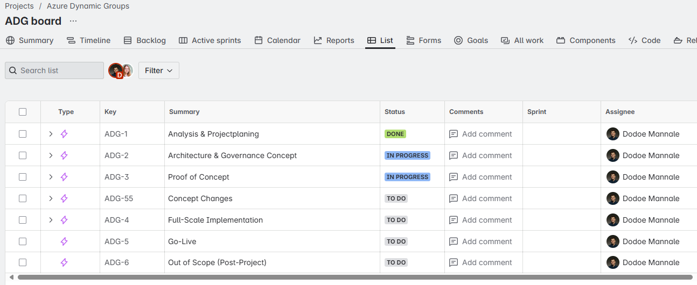
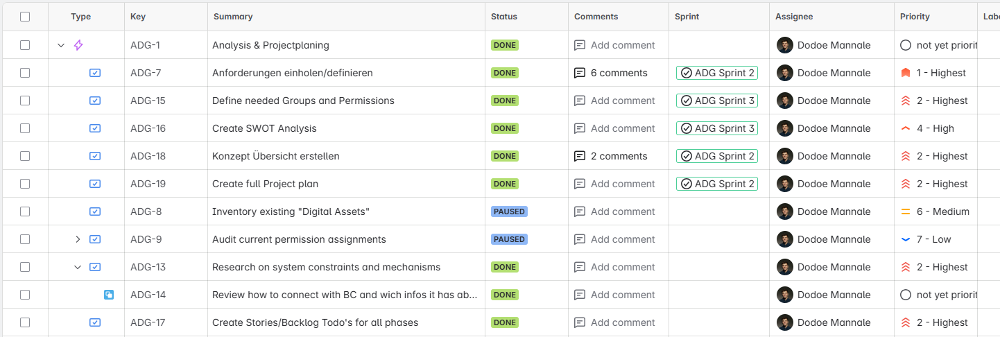
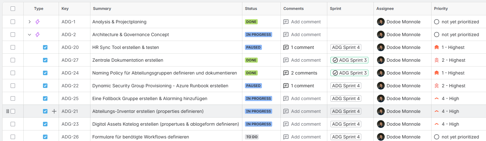
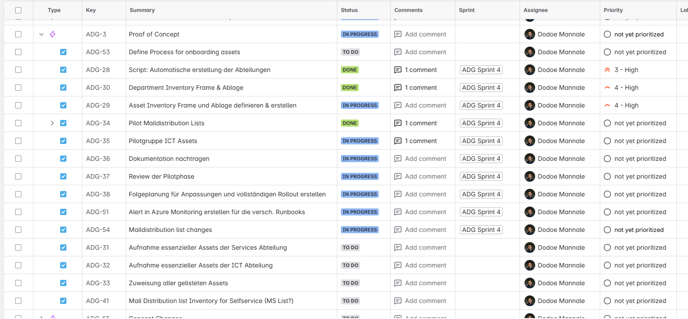
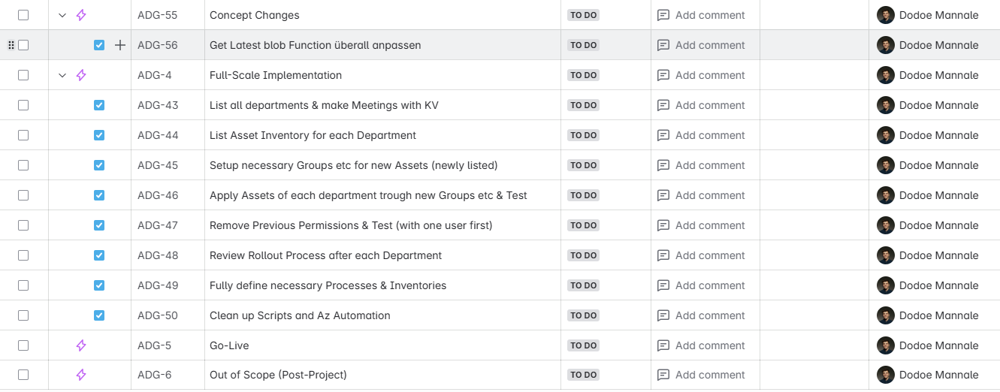

{: .no_toc }

# Projektplan und truktur
Für die Planung des Projekts habe ich die Arbeit in übergeordnete Phasen (Epics) unterteilt. Jede Phase entspricht einem klar abgegrenzten Ziel und enthält mehrere zugehörige Tasks, die im JIRA-Board verwaltet werden. Für die Semesterarbeit sind aufgrund der Zielsetzung nur die ersten drei Epics relevant. Die Epics gliedern sich wie folgt:

- Analyse & Projektplanung
- Architektur- & Governance-Konzept
- Proof of Concept
- Konzeptanpassungen
- Vollständige Implementierung
- Go-Live
- Out of Scope

## Phase 1: Analyse & Projektplanung (ADG‑1)

In dieser ersten Phase habe ich Anforderungen erhoben, eine SWOT-Analyse durchgeführt und den detaillierten Projektplan erstellt. Zu den zentralen Tasks zählen unter anderem:

- Anforderungen einholen und definieren
- Definition benötigter Gruppen und Berechtigungen
- Erstellung der SWOT-Analyse
- Erstellen des vollständigen Projektplans

## Phase 2: Architektur- & Governance-Konzept (ADG‑2)

Diese Phase umfasst die Ausarbeitung des Architekturmodells und die Festlegung der Governance-Richtlinien, inklusive Naming Policy und Konzeption der Azure Automation Runbooks. Wichtige Tasks waren:

- Definition und Dokumentation der Naming Policy für Abteilungsgruppen
- Erstellung des Runbooks für die dynamische Security Group Provisionierung
- Entwicklung und Test des HR-Sync-Tools

## Phase 3: Proof of Concept (ADG‑3)

Im Proof-of-Concept wurde der Kernprozess der automatischen Gruppen- und Mailinglisten-Erstellung umgesetzt und validiert. Zentrale Tasks:

- Skript zur automatischen Erstellung der Abteilungsgruppen
- Definition des Inventar-Frameworks und Ablagekonzepts
- Pilotierung der Mailverteilerlisten für die Services-Abteilung
- Aufbau der Pilogruppe ICT-Assets

## Phase 4: Konzeptanpassungen (ADG‑55)

Nach den ersten Tests wurden notwendige Änderungen identifiziert und dokumentiert, um das Lösungsdesign zu verfeinern. Weitere Tasks werden noch erfasst.

- Anpassung der Get-LatestBlob Funktion auf allen Runbooks
- Definition des Onboarding-Prozesses für Digital Assets
- Überarbeitung aller Runbooks
- Alle Todos aus Runbook kommentaren bearbeiten

## Phase 5: Vollständige Implementierung (ADG‑4)

In dieser Phase erfolgt die Rollout-Vorbereitung und sukzessive Umsetzung für alle Abteilungen:

- Erfassung der Inventare und separate Meetings mit den jeweiligen Key-Usern
- Einrichtung neuer Gruppen und Zuweisung der definierten Assets
- Entfernen vorheriger Berechtigungen und Testläufe
- Finale Definition der Prozesse und Inventarlisten

## Phase 6: Go-Live (ADG‑5)

Der Go-Live ist für den Projektabschluss vorgesehen. Die konkrete Terminierung und spezifischen Schritte werden später noch ausgearbeitet.

## Phase 7: Out of Scope (ADG‑6)

In den Out-of-Scope-Bereich fallen Funktionen, die für eine spätere Weiterentwicklung interessant sind, aktuell jedoch nicht zum Projektumfang gehören. 

> Go-Live und Out-of-Scope-Phasen sind zum Zeitpunkt der Dokumentation noch in Planung und dienen der künftigen Erweiterung des Projekts.

----

# Vorgesehene Sprints bis zum Abschluss der Semesterarbeit

Zu Projektbeginn habe ich fünf aufeinanderfolgende Sprints definiert, um die Arbeitsschritte bis zur Abgabe der Semesterarbeit strukturiert abzubilden. Obwohl sich der Zeitplan im Verlauf aufgrund von inhaltlichen Anpassungen und Prioritätsverschiebungen teils verändert hat, bot die Sprintstruktur eine wertvolle Orientierung. Eine detaillierte Betrachtung der tatsächlichen Sprint-Durchführung und der daraus gewonnenen Erkenntnisse erfolgt in Kapitel "3 Projektdurchführung" unter "Sprint Reviews".

## Sprint 1: Analyse & Projektplanung

In Sprint 1 lag der Fokus auf der Aufnahme und Strukturierung aller Anforderungen sowie der Erstellung des initialen Projektplans. Wichtige Aktivitäten waren:
- Einholen und Dokumentieren der Projektanforderungen (ADG‑7)
- Durchführung einer SWOT‑Analyse zur Einschätzung von Stärken, Schwächen, Chancen und Risiken (ADG‑16)
- Definition der benötigten Abteilungs‑Gruppen und Berechtigungen (ADG‑15)
- Erarbeitung des vollständigen Projektplans nach einholen der Anforderungen (ADG‑19)

## Sprint 2: Architektur & Governance-Konzept

Ziel von Sprint 2 war die Entwicklung des Architekturrahmens sowie der Governance-Richtlinien für die dynamische Gruppenverwaltung. Kernaufgaben umfassten:
- Erstellen einer allgemeinen Konzeptübersicht (ADG-18)
- Definition und Dokumentation einer Naming Policy für Abteilungsgruppen (ADG‑24)
- Konzeption und erste Implementierung des Azure Automation Runbooks zur dynamischen Security Group Provisionierung (ADG‑22)
- Entwicklung und Test des HR‑Sync‑Tools für die Synchronisation der Abteilungs-Codes (ADG‑20)

## Sprint 3: Proof of Concept

Im dritten Sprint wurde ein Proof of Concept aufgebaut, um die Automatisierung der Gruppen- und Mailinglisten-Erstellung in einer Testumgebung zu validieren. Wichtige Schritte waren:
- Implementierung des Skripts zur automatischen Erstellung der Abteilungsgruppen (ADG‑28)
- Aufbau eines Inventar-Frameworks und Festlegung der Ablagestruktur (ADG‑30)
- Fuktionalität der bisher erstellten Runbooks gewährleisten.

## Sprint 4: Abschluss Proof of Concept & Pilotphase

Sprint 4 diente der Fertigstellung des Proof of Concept und dem Start der Pilotphase in der Live-Umgebung. Wesentliche Aufgaben:
- Pilotierung der Mailverteilerlisten für die Service-Abteilung (ADG‑34)
- Einrichtung einer Testgruppe für ICT‑Assets (ADG‑35)
- Durchführung der Pilotphasen für ausgewählte Abteilungen & Review selbiger erstellen (ADG-37)

## Sprint 5: Anpassungen & Ausblick

Obwohl Sprint 5 formell nach der Abgabe der Semesterarbeit verortet ist, enthält er die geplanten Folgeanpassungen und Erweiterungen:
- Definition des Onboarding-Prozesses für Digital Assets (ADG‑53)
- Umsetzung der während der Pilotphase identifizierten Optimierungen
- Strukturierung und Dokumentation aller Prozesse und Inventarlisten für den Rollout

----

# Ressourcenplanung
Für die erfolgreiche Umsetzung des Projekts standen folgende Ressourcen zur Verfügung:

## Personelle Ressourcen
- **Projektleitung und Umsetzung (100 %):** Ich habe sämtliche Aufgaben von der Anforderungsanalyse über die Konzeption bis hin zur technischen Implementierung eigenständig übernommen.

- **Unterstützung Kommunikation:** Saskia Haas war für die Abstimmung der Kommunikationsmaßnahmen verantwortlich. 

## Wichtige Kommunikations‑Tasks (Pilotphase)
- Erstellung und Versand der Pilotankündigung an beteiligte Abteilungen
- Aufsetzen eines Feedback‑Formulars für Pilotnutzerinnen
- Koordination der Status‑Updates in wöchentlichen Abstimmungsmeetings mit Saskia Haas

## Technische Ressourcen und Infrastruktur

**Azure Sponsorship und Kontingente:**
Für das Projekt steht ein einmaliges Guthaben von 2.000 CHF im Rahmen einer Azure Sponsorship Subscription zur Verfügung. Zusätzlich gibt es eine kostenlose Compute-Quota für Azure Automation Runbooks, die mit den bisherigen Skripten kaum ausgeschöpft wird. Höhere Testaufwände würden daher maximal Kosten im Cent- bis Frankenbereich pro Monat verursachen.

**Azure Automation Runbooks:**
Die Ausführung der Runbooks erfolgt überwiegend kostenfrei innerhalb der Gratiskontingente, welche von Azure zur verfügung gestellt werden.

**Hybrid Runbook Worker:**
Ein lokal betriebener Hybrid Runbook Worker auf dem On‑Premise Server ermöglicht die Ausführung von Runbooks direkt in der lokalen Umgebung. Es fallen keine Kosten an, und die direkte Anbindung an das lokale Active Directory sorgt für hohe Ausführungsgeschwindigkeit.
    
# Kommunikationsplan

Ein klar strukturierter Kommunikationsplan stellt sicher, dass alle Beteiligten stets informiert sind und Anforderungen rechtzeitig kommuniziert werden.

## Pilotphase

**Verantwortlich:** Saskia Haas
**Zielgruppe:** Pilotabteilungen (Services, ICT)
**Maßnahmen:**
- Versand einer technischen Einführung und Anleitung per E‑Mail
- Organisation allfälliger online Einführungen für die zu implementierende Prozesse
- Bereitstellung eines zentralen Feedback-Forms

## Geplanter Rollout in allen Abteilungen

Für den finalen Rollout wird jede Abteilung einzeln angesprochen, um folgende Punkte sicherzustellen:
- Individuelle Abstimmung der benötigten Digital Assets, die aufgenommen werden müssen
- Erfassung aller relevanten Abteilungsdaten (Berechtigungen, Mailinglisten, Share‑Berechtigungen)
- Dokumentation der Ergebnisse in der zentralen Asset-Inventarliste
- Kommunikationsfreigabe und Übergabe von Bedienungsanleitungen sowie Support-Kontakten

Durch diese abgestufte Vorgehensweise gewährleiste ich, dass spezifische Anforderungen jeder Abteilung berücksichtigt werden und der Rollout transparent und nachvollziehbar verläuft.