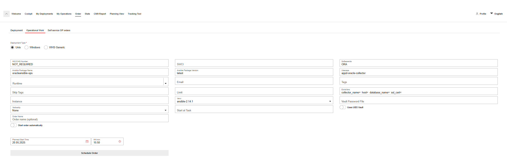

# 4.3 Ansible Playbook

## Introduction

In this part of the project, I will show some of the code from the playbook and explain how each part works. This playbook is executed by REX deployer, an app built by my company to facilitate the execution of ansible playbooks through ansible controllers.
The playbook is saved across all environments and able to be deployed in any of them by selecting it from a scrolldown menu within REX.

This is an example order of how my playbook would be executed and how the overview of this tool looks like.

<p align="center">
  
</p>

## Requirements

In order for a database collector to be created, I will need a few different pieces of information that will be added by the person executing the playbook in the form of extra vars. This information can be found in a tool called ISAC, which keeps inventory of everything in our network.

- **Collector Name**: This is the name the collector will have in our monitoring tool. The user will fill this following our current naming convention.
- **Hostname**:       This is the FQDN (Fully Qualified Name) of the server hosting the database.
- **Database Name**:  This is the FQDN of the database. 
- **SSL Cert**:       This is the database identifier or also known as SSL Certificate in the string, it is another FQDN similar to the database's.


## Code

As I have made this project for my company, I am not allowed to share the entirety of the code, as to not breach any security of privacy policies, but I will share bits and pieces and explain every part of it within this documentation.

- The name of the playbook is defined within the first line, "oracleansible-ops" - every playbook needs to end in "-ops" hence this addition to the name.
- It will run locally in the ansible controller as specified within the hosts section with "localhost".
- Gather facts is a default in every playbook, but in this case it is not needed, so I have left it in but commented out for completion purposes.
- tasks defines the start of the playbook and the actions it will take.

```yaml
- name: oracleansible-ops
  hosts: localhost
#  gather_facts: yes
  tasks:
```

### Extra Vars & Variables

Extra Var 01: Requestor gives desired name as per company guidelines.

```yaml
  - name: collector_name
    set_fact:
     collector: "{{ collector_name }}"
```



For verification purposes, the collector name gets written in the output thanks to the below:

```yaml
  - name:
    debug:
     msg: "This is the collector of the database: {{ collector_name }}"
```


Extra Var 02: Host is saved in this variable.

```yaml
  - name: host
    set_fact:
     host: "{{ host }}"
```


Extra Var 03: Database FQDN

```yaml
  - name: database_name
    set_fact:
     db_user: "{{ database_name }}"
```


Extra Var 04: OUM Identifier for the database or SLL Certificate of the database.

```yaml
  - name: ssl_cert
    set_fact:
     db_user: "{{ ssl_cert }}"

```


This will part of the code is in charge of noticing in which environment this playbook is being ran in, and execute the part of the code that belongs to said environment.
It also displays the value saved in the variable for verification purposes.

```yaml
  - name: get_runtime
    shell: |
     mc_isac | grep RUNTIME | awk '{print $2}'
    register: runtime_output

  - name: extract_usage
    set_fact:
     runtime: "{{ runtime_output.stdout }}"

  - name: show_runtime
    debug:
     msg: "runtime is {{ runtime }}"
```


### JBDC String

A JDBC string for an Oracle database in AppDynamics is a URL that tells the AppDynamics agent how to connect to the Oracle database. It includes the protocol, driver type, host, port, and database identifier.
This string is coded into my playbook with help of the extra vars above as follows:


```
jdbc:oracle:thin:@(DESCRIPTION = (ADDRESS_LIST = (ADDRESS = (PROTOCOL = TCPS)(HOST = {{ host }} )(PORT = 1522)))(CONNECT_DATA = (SERVICE_NAME = {{ database_name }}))  (SECURITY = (SSL_SERVER_CERT_DN = \"{{ ssl_cert }},OU=OracleDB,OU=CA,O=UBS,C=CH\")))
```
