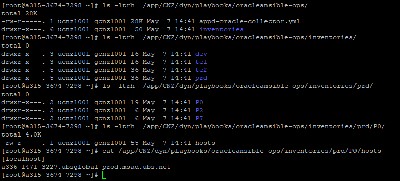

# 4.2 Structure of the ansible controller

Luckily, we already count with an ansible controller, in charge of executing playbooks.

Within this ansible controller, which there is more than one for every environment, a certain structure of files needs to be created.

As per shown below, this is what it looks like to have a playbook in one of these.

All environments need to be defined for every controller, regardless of where this is located, because the contents should be the same across every server.

## Visual Structure plan WIP